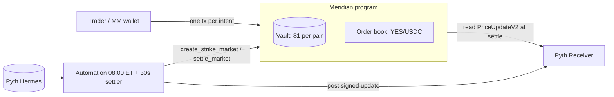

# Meridian: Binary Stock Outcome Markets on Solana

Non-custodial, same-day (0DTE) binary contracts on the closing prices of the MAG7 stocks (AAPL, MSFT, GOOGL, AMZN, NVDA, META, TSLA).

> **"Will META close at or above $680 today?"** A YES token pays **$1.00 USDC** if it does. A NO token pays $1.00 if it doesn't. **YES + NO = $1, always.**

Everything that matters is enforced on-chain by one Anchor program: minting pairs against a $1 vault, a **central limit order book** (price-time priority), the **trading halt at the close**, **Pyth oracle settlement** with staleness and confidence checks, a time-delayed admin override, and redemption. An automation service creates each morning's strikes and settles at the close. A Next.js app lets users trade all four directions (Buy/Sell × YES/NO) on a single book.

| | |
|---|---|
| Program (devnet) | `2rnq72LPCH1aAGKvJrFU6YWAy6XCQh2ERofPhuqA7YCG` |
| Repo | GitLab `labs.gauntletai.com/sefathchowdhury/meridian` · mirror [github.com/hisefath/meridian](https://github.com/hisefath/meridian) |
| Docs | [PRD](docs/PRD.md) · [System design (Mermaid)](docs/SYSTEM_DESIGN.md) · [Architecture & trade-offs](docs/ARCHITECTURE.md) · [Deployment guide](docs/DEPLOYMENT.md) · [Test results](docs/TEST_RESULTS.md) · [Risks & limitations](RISKS.md) · [AI usage log](docs/AI_USAGE.md) |

## Quick start

```bash
make dev          # npm install + Next.js on http://localhost:3000 against devnet
```
Then connect Phantom or Solflare (set to devnet), click **Get test USDC**, and trade.

Full build, test and deploy (needs only Docker + Node 22, no local Rust/Solana install):
```bash
cp .env.example .env     # add PYTH_API_KEY for oracle settlement + live prices
make toolchain           # one-time: native program toolchain image
make build               # program → target/deploy/meridian.so, IDL → sdk/
make test                # Rust unit/property + LiteSVM integration + automation + frontend
make deploy-devnet setup-devnet
make lifecycle-devnet    # create → mint → trade (4 paths) → settle → redeem, on devnet
make automation          # daily scheduler: 08:00 ET market creation + settlement loop
```

## How it works



**One book, four actions.** Each strike has exactly one order book, YES against USDC. NO is never traded directly:

| User clicks | What happens on-chain (one atomic transaction) |
|---|---|
| Buy YES | `place_order(Bid)` |
| Sell YES | `place_order(Ask)` |
| Buy NO | `mint_pair` + `place_order(Ask)`: mint YES+NO for $1, sell the YES, keep the NO |
| Sell NO | `place_order(Bid)` + `redeem_pair`: buy YES, merge YES+NO back into $1 |

Market orders are fill-or-kill with a slippage bound, so a Buy NO can never leave a stray YES behind. The UI blocks Buy YES while you hold NO (and vice versa), per the brief.

**Daily lifecycle.** At 08:00 ET the automation checks Pyth's market calendar, reads each stock's previous close, and creates strikes at ±3/6/9% (plus at-the-money), rounded to $10 and de-duplicated. Trading runs until `close_ts` (16:00 ET, or 13:00 on early-close days), when **the program itself rejects new orders and mints**. The settler then posts the Pyth price at the close and settles every strike. The outcome is written once and is immutable. Winners redeem $1 per token, forever.

## Repository layout

```
programs/meridian/   Anchor program (Rust): lib.rs instructions · book.rs matching engine · oracle.rs Pyth parsing
sdk/                 Shared TS: PDAs, instruction builders, book views, trade intents, P&L ledger, strikes
automation/          Node/TS service: morning job + settler, Hermes client, Dockerfile
app/                 Next.js frontend: Landing · Markets · Trade · Portfolio · History (+ /api/prices, /api/faucet)
tests/               LiteSVM integration tests against the compiled program
scripts/             devnet setup, end-to-end lifecycle, IDL generator
docker/              lean program toolchain + Solana CLI images
docs/                PRD, system design (+ .mmd sources), architecture, deployment, tests, AI usage
```

## Key design decisions (details in [ARCHITECTURE.md](docs/ARCHITECTURE.md))
- **Own minimal CLOB inside the program**, not Phoenix/OpenBook. An external venue can't know our market closed at 4:00 PM. The on-chain halt is the one rule a 0DTE binary venue must respect.
- **Permissionless, oracle-validated settlement.** Liveness doesn't depend on our server. The admin override only unlocks after a delay.
- **Freshness measured against the close, not "now".** We want *the closing price*, even when settling at 16:05.
- **Integers only on the money path.** Prices are cents, quantities are whole contracts, prices and strikes are micro-USD. No float can round an at-the-strike close to the wrong side.
- **Collateral invariant enforced on-chain** after every mint/redeem: `vault ≥ collateral ≥ supply × $1`. The tests assert exact equality.

## Status
See [docs/TEST_RESULTS.md](docs/TEST_RESULTS.md) for current test counts and the devnet run log, and [RISKS.md](RISKS.md) for known limitations. This is a devnet prototype: test funds only, no regulatory claims.
