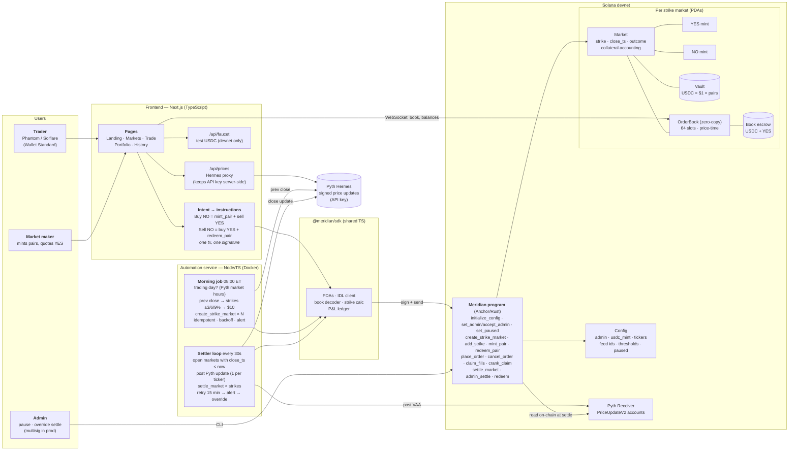
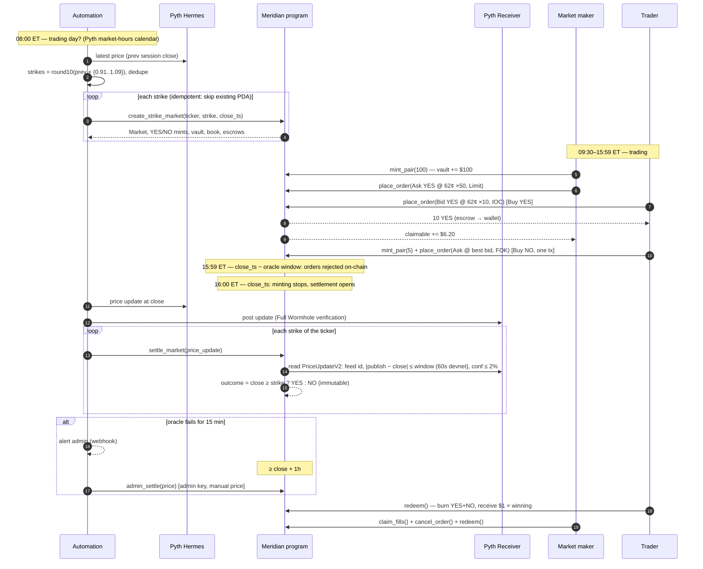
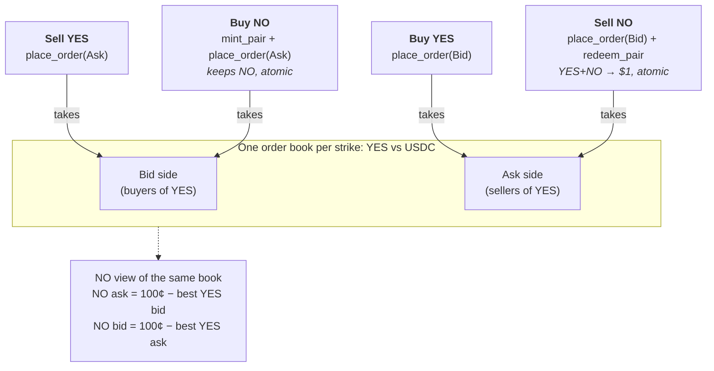

# Meridian — System Design

> Diagram sources live next to this file: [`system-design.mmd`](system-design.mmd), [`lifecycle.mmd`](lifecycle.mmd), [`trade-paths.mmd`](trade-paths.mmd). GitHub and GitLab render the blocks below natively. For the *why* behind each choice, see [`ARCHITECTURE.md`](ARCHITECTURE.md).

## 1. Architecture at a glance

There are three deployables and one shared library, all in one repo (the brief requires the service to live with the contract and frontend):

| Component | Tech | Responsibility | Trust level |
|---|---|---|---|
| `programs/meridian` | Rust, Anchor 0.32 | Custody (vaults, escrow), minting, **order matching**, settlement validation, redemption, pause | The only trusted code. Every invariant is enforced here |
| `automation/` | Node 22 + TypeScript, Docker | Morning market creation; settlement loop; alerts | **Untrusted for correctness.** It can only call instructions the program validates. `settle_market` is permissionless |
| `app/` | Next.js + React + wallet-adapter | Intent → instruction translation, real-time book, portfolio/P&L, position constraints | Untrusted. It is a convenience layer, and the chain re-checks everything that matters |
| `sdk/` | TypeScript | PDAs, instruction builders, book decoder, strike math, P&L ledger | Shared by the app, automation, scripts and tests, so **tests exercise the same code paths users hit** |

## 2. The daily lifecycle

## 3. One book, four trade paths

The UI shows NO prices as the inverse of the YES book. Buy NO and Sell NO are **client-composed atomic transactions**: several program instructions in one Solana transaction, signed once. If any step fails, the whole transaction reverts, so a user is never left holding an unintended YES+NO pair from a market order. Market orders use **fill-or-kill** with a slippage-bounded limit price.

## 4. On-chain account model

| Account | Seeds | Size | Notes |
|---|---|---|---|
| `Config` | `["config"]` | ~400 B | admin, USDC mint, paused, `max_staleness_secs`, `max_conf_bps`, `override_delay_secs`, 7 tickers + Pyth feed ids |
| `Market` | `["market", ticker_idx, close_ts, strike]` | ~300 B | strike (micro-USD), close_ts, outcome, settle price, `collateral` accounting |
| YES / NO mint | `["yes"\|"no", market]` | 82 B | 0 decimals (1 token = 1 contract). Mint authority = Market PDA, so **only `mint_pair` can mint** |
| Vault | `["vault", market]` | 165 B | USDC token account owned by the Market PDA. Holds only pair collateral |
| OrderBook | `["book", market]` | ~4.2 KB zero-copy | 64 order slots (owner, side, price¢, qty, seq, claimable) |
| Book escrow | `["book_usdc"\|"book_yes", market]` | 165 B each | Bids escrow USDC and asks escrow YES. Kept separate from the vault so the vault invariant stays exact |

Every amount is an integer. Prices are whole cents (1–99), quantities are whole contracts, USDC is 6-decimal base units, and strikes and oracle prices are micro-USD. `cost = qty × price¢ × 10,000`. No floats and no rounding anywhere on the money path.

## 5. Settlement path (the correctness-critical part)

`settle_market` is **permissionless**, so liveness does not depend on our server. It accepts a Pyth `PriceUpdateV2` account and enforces all of the following:

1. Account owner = Pyth Receiver program, and the discriminator matches `PriceUpdateV2`.
2. `verification_level == Full` (all guardian signatures verified, not partial).
3. `feed_id == config.feed_ids[market.ticker]`, so nobody can settle META with a TSLA price.
4. `now ≥ close_ts` and the outcome is still `Open` (written once, immutable).
5. Freshness: `|publish_time − close_ts| ≤ max_staleness_secs` (60s on devnet; the brief suggests ≤ 5 min). Orders already halted at `close_ts − max_staleness_secs`, so no print in this window can be traded on. The check is relative to the **close**, not to "now": we want the closing price even if settlement runs at 16:05.
6. Confidence: `conf × 10,000 ≤ max_conf_bps × price` (default 200 bps).
7. `price_micro = floor(price × 10^(expo+6))`, then **YES wins iff `price_micro ≥ strike_micro`**. Flooring is exact for this comparison because strikes are integers.

If the oracle path keeps failing for 15 minutes, the settler alerts. After `close_ts + 1h` the admin can call `admin_settle(price)`, which records `settled_by_override = true` for audit.

## 6. Failure modes and responses

| Failure | Effect | Response |
|---|---|---|
| Automation down at 08:00 | No markets that day | Restart → the morning job is idempotent and creates any missing strikes; alert fires on failure |
| Automation down at 16:00 | Settlement delayed | Anyone can call `settle_market` (it is permissionless); the settler catches up on restart because it is driven by on-chain state, not by a cron tick |
| Pyth stale/wide/unavailable | `settle_market` rejects | Retry every 30s for 15 min, alert, then admin override after the 1h delay |
| Bug or exploit discovered | Risk to funds | `set_paused(true)` blocks mint and new orders. Users can still cancel, claim and redeem |
| Admin key compromise | Can pause, and can override-settle unsettled markets after the delay | Delay gives the oracle path first claim; prod = multisig + timelock (see `RISKS.md`) |
| Someone donates USDC to a vault | Strict `==` checks would brick the market | Program checks `vault ≥ collateral` (solvency) and keeps exact internal accounting |
| Order book full (64 slots) | New resting orders rejected (`BookFull`) | Filled-but-unclaimed slots are freed by anyone via `crank_claim` (the SDK does this automatically before quoting). Upgrade path: larger zero-copy book |

## 7. Assumptions (and what changes if they are wrong)

| Assumption | If wrong |
|---|---|
| Pyth's regular-session equity feed stops publishing at the close, so the last print ≈ the close | Tighten `max_staleness_secs` (e.g. 30s) or switch to an official closing-auction feed |
| Devnet faucets supply enough SOL for daily market rent (~0.04 SOL/strike) | Reduce strikes per stock, or add `close_book` rent reclaim |
| One admin key is acceptable on devnet | Swap the admin for a Squads multisig; no program change needed (`admin` is just a pubkey) |
| A single 64-slot book per strike is enough liquidity depth for a demo | Bump `MAX_ORDERS` (account ≤ 10 KB for CPI init), or move to a crit-bit book like Phoenix |
| Users have devnet SOL for fees | The faucet route can drip SOL; or use a fee-payer relayer |

## 8. Build plan

| Phase | Output | Exit criterion |
|---|---|---|
| 0 | PRD, this doc, architecture/trade-offs, decision journal, repos | Docs pushed to GitLab + GitHub |
| 1 | Anchor program: config, markets, mint/redeem, CLOB, settlement, override, pause | `cargo test` (pure logic + proptests) green |
| 2 | SDK + LiteSVM integration tests | Every instruction, 4 trade paths, multi-user lifecycle, oracle validation, override delay, invariants after every op |
| 3 | Automation service | Morning + settle jobs pass against LiteSVM/localnet; dry-run against devnet |
| 4 | Frontend | 5 pages; Vitest UI-flow tests green |
| 5 | Devnet deployment + scripted lifecycle | `make devnet-lifecycle` runs create → mint → trade → settle → redeem on devnet |
| 6 | Deployment guide, test results, AI usage log, risks, demo script | All brief deliverables present |
